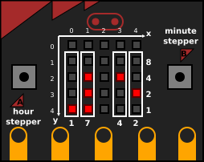

# BBC micro:bit BCD clock

My first project with the micro:bit is a [binary coded decimal clock](https://en.wikipedia.org/wiki/Binary_clock#Binary-coded_decimal_clocks). The micro:bit has a 5x5 led matrix that is suitable for an hour:minute BCD clock.

It also has two buttons, button A will be used to step hours and button B will be used to step minutes.

The led matrix is indexed from the top left corner. The first two column is used for the hour display and the last two is used for the minutes. The middle column is unused.

As 4 bit (and led) is more than enough to represent a decimal digit, the first row is also unused.



The code is written in [MicroPython](https://micropython.org/).


# Requirements

- a micro:bit board
- [uflash](https://pypi.python.org/pypi/uflash)

# Install

1. clone repo
2. compile source
	```
	$ uflash bcd_clock.py .
	```
3. copy the `micropython.hex` to the micro:bit „drive”

# Caveats

The code is extremely unoptimized, thus it takes far too long to calculate which LEDs has to be set and this causes that the clock is losing.